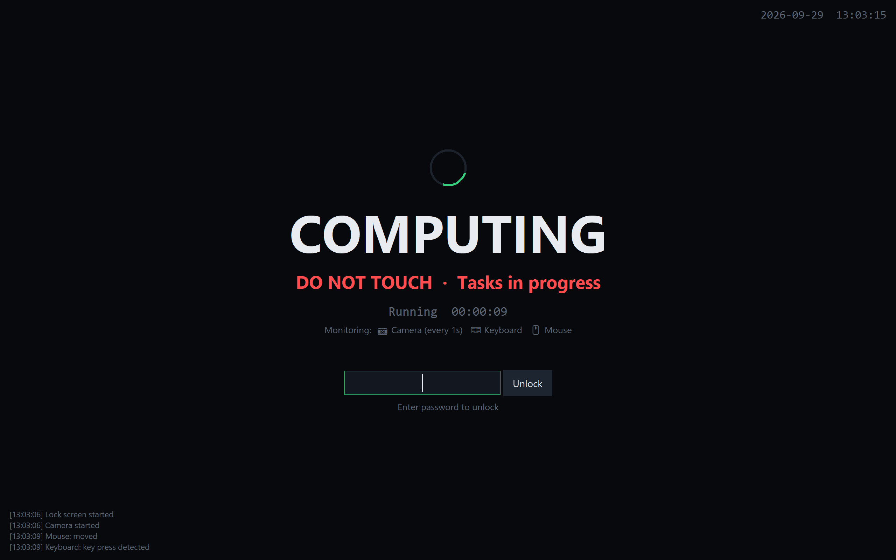

# Computing Lock Screen

A lock screen for Windows and Linux for when you step away while long jobs run (vibe coding, training, builds):
a full-screen **"COMPUTING · DO NOT TOUCH"** display, background programs keep running, and a
password unlocks it. Optional camera, keyboard and mouse activity detection. English / 中文.



## Download

Grab an exe from [Releases](../../releases) — no Python needed:

| File | Size | Camera detection |
|---|---|---|
| `ComputingLock.exe` | ~10 MB | no |
| `ComputingLock-Camera.exe` | ~61 MB | yes |

**Windows:** put the exe in its own folder (for example `%LOCALAPPDATA%\Programs\ComputingLock`) and
double-click it; `config.json`, `captures/` and `logs/` are created next to it. The exe is unsigned, so Windows
SmartScreen may say "Windows protected your PC" the first time: click "More info" → "Run anyway".

**Linux (x86-64):** use `ComputingLock` / `ComputingLock-Camera` from the same release. Put it in its own folder
(for example `~/.local/opt/ComputingLock`), then `chmod +x ComputingLock && ./ComputingLock`.
Built on Ubuntu 22.04, so it runs on distros with glibc 2.35 or newer.

## Features

- Custom title / subtitle / note; covers all monitors and stays on top
- Password unlock (PBKDF2 hash stored in `config.json`); wrong attempts are logged but never lock you out
- Camera detection: camera index, check interval (seconds), sensitivity, face detection;
  snapshots saved to `captures/` on alerts
- Keyboard / mouse activity detection, throttled to one report per 3 s
  (Windows: native low-level hooks; Linux: the lock window's own input)
- Blocks system shortcuts (Windows: Win key, Alt+Tab, Alt+Esc, Alt+F4;
  Linux X11: all window-manager shortcuts, by grabbing keyboard and mouse like `i3lock` does)
- Prevents system sleep / display turning off (Linux: `systemd-inhibit` plus the X screensaver reset)
- Shows a session summary after unlocking; logs saved to `logs/`

## Snapshots

- **View:** "Open snapshots folder" in the settings window or in the summary after unlocking.
- **Delete:** "Delete all" in the settings window.
- **Auto-delete:** 24 hours after the session ends by default ("Auto-delete after (h)"; 0 = keep forever).
  A tiny background process deletes them on time even if the app is closed; if the PC restarts before
  then, they are deleted the next time the app starts.

## Run from source

Python 3 with tkinter is all that's required (on Debian/Ubuntu: `sudo apt install python3-tk`).
Camera detection is optional:

```
pip install "opencv-python-headless>=4.8,<5"
python lockscreen.py
```

OpenCV must be 4.x: version 5.0 removed the Haar cascade used for face detection.
OpenCV is only loaded when camera detection is turned on.

Build the exes with `build.bat` on Windows, or the Linux binaries with `sh build.sh`
(both need `pip install pyinstaller` plus OpenCV for the camera build).
`python tests/smoke_test.py` opens the real lock screen for a few seconds and unlocks itself;
the Linux workflow runs it under Xvfb and uploads the binaries as build artifacts.

## Notes

- **Ctrl+Alt+Del is protected by Windows and cannot be blocked by any program.** Someone could still
  open Task Manager and end this app, so treat it as a "don't touch" deterrent, not a security lock.
  Use Win+L when you need real security.
- Forgot the password: Ctrl+Alt+Del → Task Manager → end the `ComputingLock` process.
- Some antivirus tools flag PyInstaller exes that install keyboard hooks; allow it if that happens.

### Linux notes

- **Use an X11 session for full protection.** Under Wayland the app runs through XWayland: it still covers
  the screen and asks for the password, but the compositor keeps its shortcuts (Super, Alt+Tab, …) and
  keyboard / mouse activity is only seen while the lock window has focus. The settings window warns about this.
- **Ctrl+Alt+F1…F12 switches virtual terminals in the kernel and cannot be blocked**, just like
  Ctrl+Alt+Del on Windows. Same "deterrent, not security" rule: use your desktop's own lock for real security.
- Forgot the password: Ctrl+Alt+F3 (or F2…F6), log in, `pkill -f ComputingLock` (or `pkill -f lockscreen.py`
  when running from source), then switch back with Ctrl+Alt+F1 / F2 / F7 depending on the distro.
- Camera detection uses V4L2; your user needs access to `/dev/video*` (usually the `video` group).

## License

[MIT](LICENSE)
